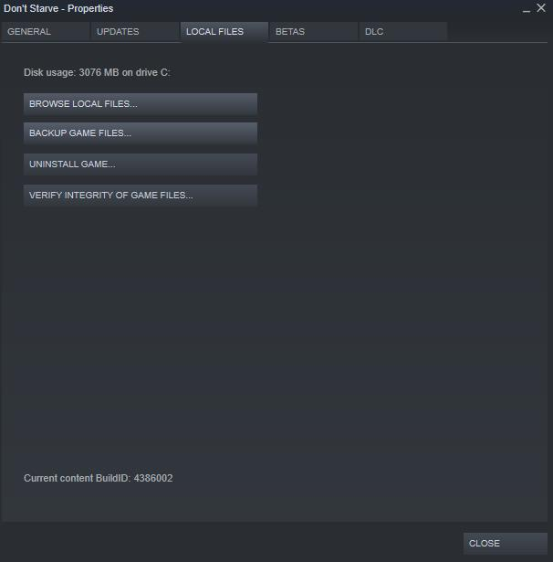

# Dont-Starve-Mod
This is a character mod of a popular wilderness survival game Don't Starve. Install our mod and have fun! 

## Table of Contents

- [Character Features](#Character Features)
- [Install](#install)
- [Contributors](#contributors)

# Character Features

Character Name: Nezha
- two forms (small form and big form), which can tranform to each other under different conditions
- two forms have distinct appearance and properties (i.e., defense value, attack value etc.)
- three featured item/weapons: Fire Spear, Qiankun Ring, and Red Armillary Sash

For detailed information, please see the [DesignOfNeZha.md](ChickenDinner/docs/DesignOfNeZha.md)

# Install
## 1. Install Don't Starve
If you don't have "Don't Starve", do not hesitate and buy one in steam, you'll like it!

Log in steam, go to your library, search for "Don't Starve" then right click it, then select properties.

In properties window, choose LOCAL FILES, then BROWSE LOCAL FILES. Go to mod folder.

## 2. Install ChickDinner Mods
To install our mod, copy paste ChickDinner folder into mod folder 

## 3. Start ChickDinner mods
### Easy Start
Start your Don't Starve, click on "Mods" button in the main menu.

In mods page, find "Chicken Dinner Mod", double click it, and it would show "To be Enabled",

Click on "Apply" to active the mod.

### Advanced Operation
Click on "Configure Mod" button, and go to Configure page to adjust parameters of Nezha character as your preference.

## 4. Start a New Game with our Mods
It's time to start a new game! Have fun!

Click on "Play!", "New Game" and then select "DS"or what ever you want, click on "Character" and go to character menu, find our new character named Nezha, apply it. Now you can start game.

# Contributors
[@ya-gao](https://github.com/ya-gao)
[@zheminggu](https://github.com/zheminggu)
[@cowryao](https://github.com/cowryao)
[@wenyi17](https://github.com/Wenyi17)

